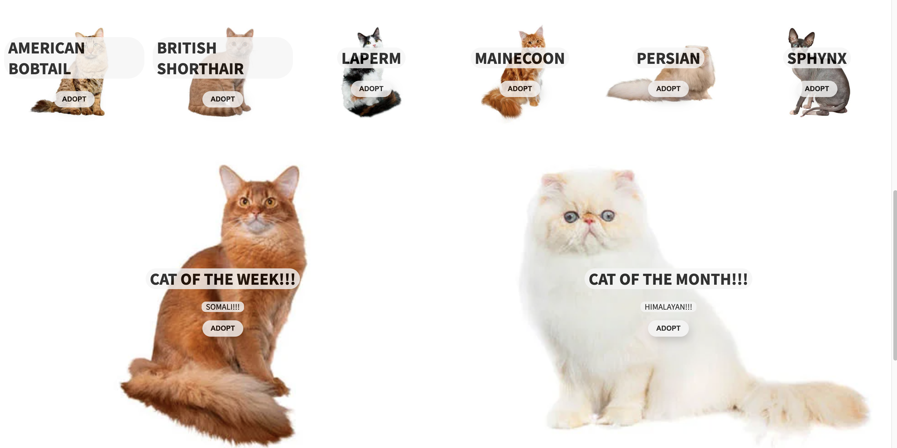

# Cat App


## Table of Contents
* [Description](#description)
* [Assets](#assets)
* [Assets](#assets)
* [Installation](#installation)
* [Usage](#usage)
* [Contributing](#contributing)
* [Questions](#questions)

## Description
Cat-App is a fully functioning MERN-stack single-page application built with a React front end, MongoDB database, and Node.js/Express.js server and API. It's already set up to allow users to save cats, adopt cats.

- Deployed link: https://github.com/scottwatt/Cat-app-trial
- Live: 


## More details
```
Use React for the front end.

Use GraphQL with a Node.js and Express.js server.

Use MongoDB and the Mongoose ODM for the database.

Use queries and mutations for retrieving, adding, updating, and deleting data.

Be deployed using Heroku (with data).

Have a polished UI.

Be responsive.

Be interactive (i.e., accept and respond to user input).

Include authentication (JWT).

Protect sensitive API key information on the server.

Have a clean repository that meets quality coding standards (file structure, naming conventions, best practices for class and id naming conventions, indentation, high-quality comments, and so on).

Have a high-quality README (with unique name, description, technologies used, screenshot, and link to deployed application).
```
## Assets

The following images demonstrate the web application's appearance and functionality:





## Installation 
The user should clone the repository from GitHub and download Node. 
Run `npm i ` in client to install.
Run `npm i ` in server to install.
Run `npm start ` to start.

## Contributing 
Contributors should read the installation section. 

## Technologies used

```
RESTful API
GraphQL API: Apollo Server
JWT Auth
Node.js
Express.js
Redux
MERN stack, with a React front end, MongoDB database, and Node.js/Express.js server and API
```
